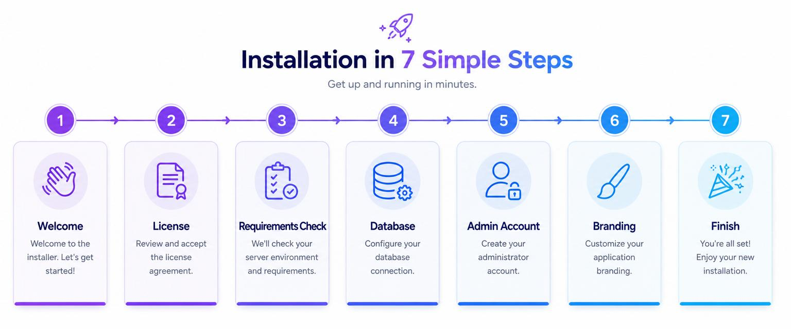
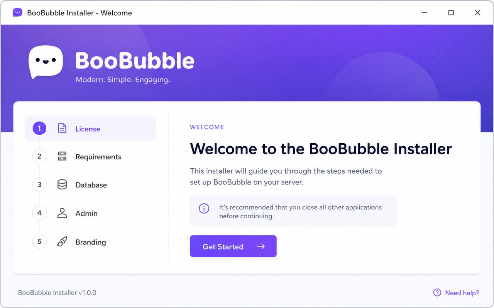
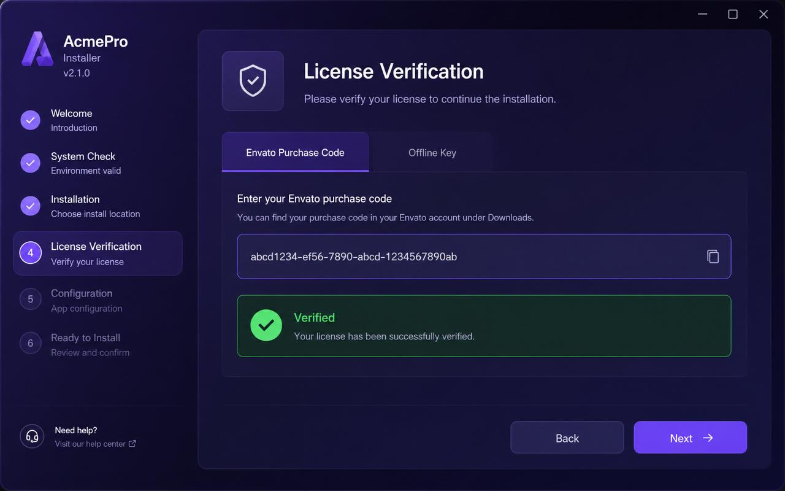
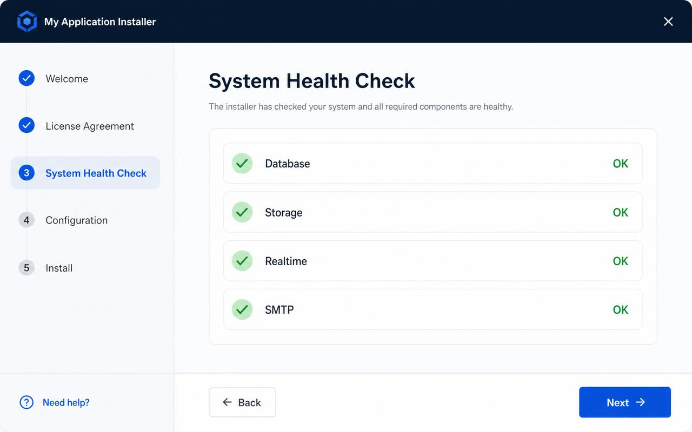
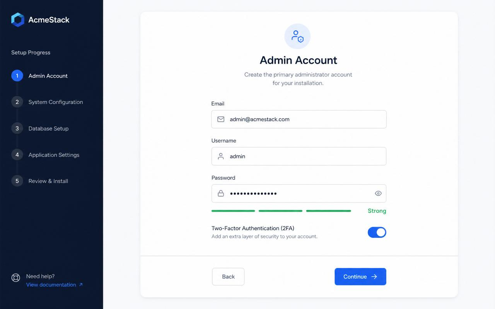
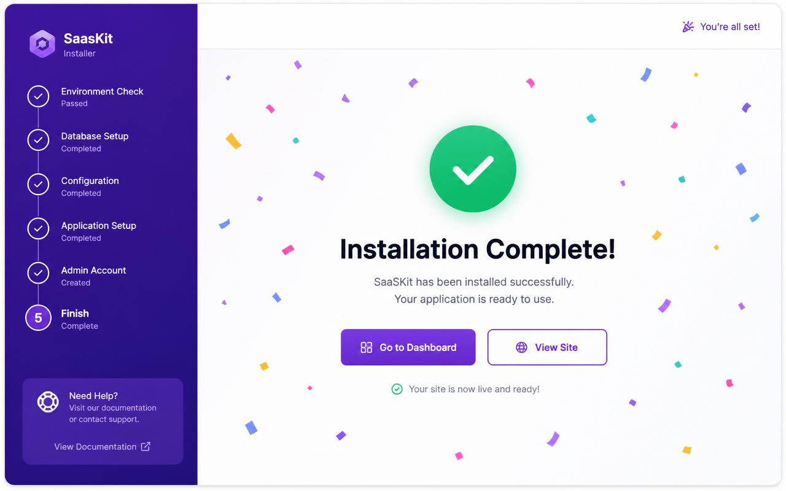

# BooBubble — End-to-End Installation Walkthrough (with Screenshots)

This guide walks you visually through installing BooBubble from the very
first click to a running community. It complements `installation-guide.md`
(text-only reference) and `SELF_HOSTING.md` / `SELF_HOSTING_BACKEND.md`
(deployment-specific docs).

> Two installation modes are supported and auto-detected by the installer:
> - **Cloud mode** — running on Lovable Cloud (database auto-provisioned)
> - **Self-Hosted mode** — running on your own server with your own Supabase

---

## Overview — The 7 steps



| # | Step                  | What happens                                          |
|---|-----------------------|-------------------------------------------------------|
| 1 | Welcome               | Intro + mode detection (Cloud vs Self-Hosted)         |
| 2 | License Verification  | Envato purchase code or Offline key                   |
| 3 | Requirements Check    | Pre-install + System Health (DB, Storage, Realtime, SMTP) |
| 4 | Database / Supabase   | Auto-skipped in Cloud mode; configured in Self-Hosted |
| 5 | Admin Account Setup   | Email, password strength, optional 2FA                |
| 6 | Site Branding         | Site name, logo, favicon, theme                       |
| 7 | Finish                | Lock installer, redirect to dashboard                 |

Estimated time: **5–15 minutes**.

---

## Before you begin

| Requirement | Notes |
|-------------|-------|
| Node 20+ / Bun 1.1+ | For self-hosted only — Cloud mode runs in your browser. |
| A valid license     | Envato purchase code **or** offline key (format `BOOB-XXXX-XXXX-XXXX-XXXX`). |
| Admin email         | You'll use this to sign in after install. |
| (Self-hosted) Supabase project | URL + anon key + service-role key. |
| (Optional) SMTP     | Resend, SendGrid, Postmark, Mailgun — to verify outgoing email. |

Open the installer at: **`/installer`** on your deployment.

> The installer is locked automatically once installation completes
> (`installed.lock` flag in the database). To re-run it, an existing
> super-admin must visit **Admin → System → Reset Installer Lock**.

---

## Step 1 — Welcome



- The installer auto-detects whether you're on **Lovable Cloud** or a
  **self-hosted** environment (`detectInstallMode()` in
  `src/lib/installer.ts`).
- Cloud installs skip the database configuration step entirely — your
  backend is already wired up.
- Click **Get Started** to begin.

---

## Step 2 — License Verification



Two license types are supported:

### Envato purchase code
- UUID format: `xxxxxxxx-xxxx-xxxx-xxxx-xxxxxxxxxxxx`
- Found in your Envato downloads page (Codecanyon).

### Offline key
- Format: `BOOB-XXXX-XXXX-XXXX-XXXX`
- Issued for self-hosted enterprise buyers and offline environments.

Validation runs locally first, then is verified server-side via the
`complete_installation` RPC. A green **Verified** badge confirms success.

---

## Step 3 — Requirements & System Health Check



Two stacked checks run here:

### Pre-install compatibility
- Environment variables present
- `pg_cron` extension enabled
- Required scheduled jobs registered

### System Health Check
| Component | What's verified |
|-----------|-----------------|
| **Database** | Connection + RPC reachability |
| **Storage**  | Buckets `avatars` and `feed-media` exist |
| **Realtime** | WebSocket subscription succeeds |
| **SMTP**     | Sends a verification email to the admin address (click **Send test**) |

A failing check shows a red ✕ with a fix-it hint. Resolve before proceeding.

---

## Step 4 — Database / Supabase Configuration

**Cloud mode:** this step is automatically skipped — the database is
already provisioned and the keys are injected.

**Self-hosted mode:** paste your Supabase credentials:

```env
SUPABASE_URL=https://<project-ref>.supabase.co
SUPABASE_PUBLISHABLE_KEY=<anon key>
SUPABASE_SERVICE_ROLE_KEY=<service-role key>
```

Then run migrations from your shell:

```bash
bunx supabase db push
```

The installer verifies the schema version before letting you proceed.

---

## Step 5 — Admin Account Setup



Create the first super-admin account.

| Field | Rules |
|-------|-------|
| Email | Valid email, becomes the login. |
| Username | 3–24 chars, alphanumeric + `_`. |
| Password | Minimum 12 chars. Live strength meter shows Weak → Strong. |
| 2FA | Optional but **strongly recommended** for production. |

Under the hood the installer calls `bootstrap_first_admin()` which:
1. Creates the auth user
2. Inserts a `super_admin` row in `public.user_roles`
3. Marks the installer as initialized

---

## Step 6 — Site Branding

Set the basics that show up everywhere:

- **Site name** (used in `<title>`, emails, OG tags)
- **Tagline**
- **Logo** (light + dark variants — uploaded to `feed-media` bucket)
- **Favicon**
- **Default theme** (Light / Dark / System)

All values are stored in the `app_settings` table under the `branding` key
and can be edited later from **Admin → Appearance**.

---

## Step 7 — Finish



You'll see a confetti screen and:

- **Go to Dashboard** → admin panel
- **View Site** → the public homepage

A post-install dashboard panel summarises:
- License type & expiry
- DB schema version
- Number of users / chatrooms / posts seeded
- Quick links: SMTP settings, Theme, First post

---

## Installation Logs

A live terminal at the bottom of the installer captures every step:

```
[10:14:02] INFO  License verified (envato)
[10:14:05] INFO  pg_cron OK — 4 jobs registered
[10:14:06] INFO  Bucket "avatars" exists
[10:14:07] INFO  SMTP test sent to you@example.com
[10:14:18] PASS  Admin account created (id: 8d2…)
[10:14:19] DONE  Installation complete
```

Click **Copy logs** to share with support if anything fails.

---

## Day-2 — Where to go next

| Task | Location |
|------|----------|
| Reset installer lock | `/admin/system` → Reset Installer Lock |
| Backup database/media | `/admin/backup` |
| Toggle signup / guest | `/admin/signup-access` |
| Voice notes limits | `/admin/voice-notes` |
| Calls (LiveKit/Agora) | `/admin/calls` |
| Audit logs | `/admin/audit-logs` |

---

## Troubleshooting

| Symptom | Fix |
|---------|-----|
| `/installer` redirects to `/login` | Already installed. Reset from `/admin/system`. |
| "License invalid" | Recheck format (UUID for Envato, `BOOB-…` for offline). |
| SMTP test fails | Verify host/port/credentials; check sender domain SPF/DKIM. |
| Realtime ✕ | Enable Realtime publication on chat tables (see `SELF_HOSTING_BACKEND.md` §6). |
| "permission denied for table user_roles" | Run `GRANT SELECT ON public.user_roles TO authenticated;` in the SQL editor. |
| Health check passes but admin login fails | Confirm the user row exists in `public.user_roles` with role `super_admin`. |

---

## Related docs

- [installation-guide.md](./installation-guide.md) — text-only quick reference
- [SELF_HOSTING.md](../SELF_HOSTING.md) — running off-platform
- [SELF_HOSTING_BACKEND.md](../SELF_HOSTING_BACKEND.md) — full Docker stack
- [codecanyon-handoff.md](./codecanyon-handoff.md) — buyer packaging notes
